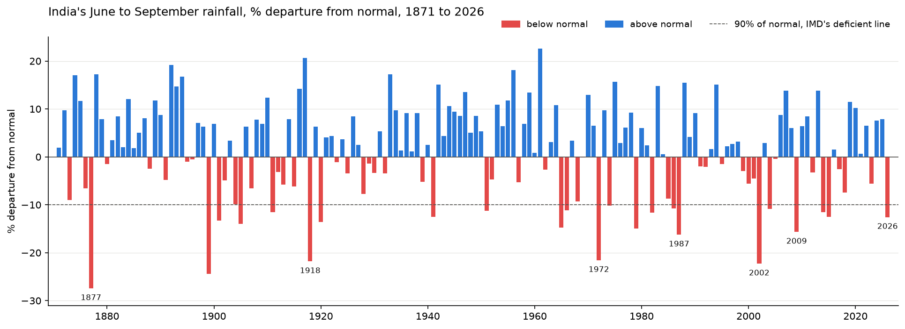
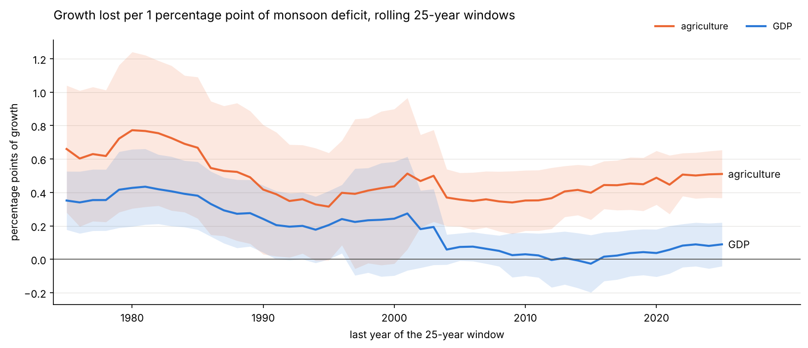
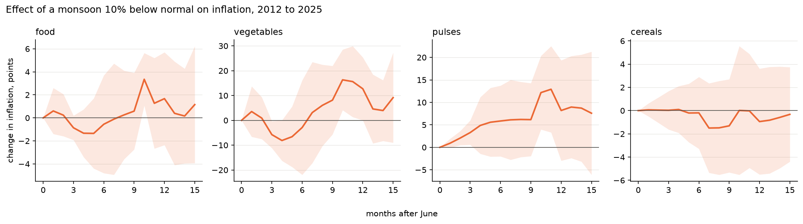

# Monsoon and the Indian economy

How much does a weak monsoon still hurt India? I wanted to check three things with official data: whether a bad monsoon lowers farm and GDP growth, whether it pushes up food prices and how fast, and what the Government of India and RBI did in recent drought years.

The 2026 monsoon ended at 87% of normal, the weakest since 2015, so this is also a way to read what might happen next.



Red years are below normal and the dashed line is the 90% mark IMD uses for a deficient monsoon, 2026 is one of only 22 years below it since 1871.

## What I found

A weak monsoon still hits farming hard. Over 1951-52 to 2025-26, every 1 percentage point of rainfall below normal cut agriculture's growth by about 0.52 points (p < 0.001), and in deficient years farm output shrank by 2.9% on average. A good monsoon doesn't help nearly as much, the effect of extra rain is small and not significant.

But the link to GDP has mostly gone. Before 1991 each point of deficit took about 0.30 points off GDP growth. After 1991 it is about 0.02, and that drop is statistically significant (p = 0.018). The effect on farming itself barely changed (0.57 before, 0.43 after), so the monsoon still matters to farmers, it just doesn't move the whole economy now that agriculture is under a fifth of it.



The GDP line falls to about zero after the early 2000s while the farm line stays well above it.

On prices, small shortfalls don't do much, but a deficient monsoon (below 90% of normal) is followed by food inflation about 4.6 points higher in the next financial year (wholesale food prices, 1953 to 2025, p = 0.05). Month by month, pulses and vegetables react, roughly 10 to 12 months after the monsoon, while cereals hardly move.



Pulses and vegetables rise about 10 to 12 months after a weak monsoon, cereals stay flat. The shaded bands are wide because only about 13 monsoons are in this window.

Cereals staying flat fits the Government of India's large rice and wheat stocks. In 2023, cereal inflation kept cooling after the wheat stock limits, FCI open market sales and the rice export ban, even while overall food inflation rose. Pulses in 2015 had no such stock, inflation hit 46% in November 2015 and only fell back a year later after a buffer stock was set up and the next crop came in. These before and after comparisons can't prove the measures worked, since the government acts when prices are already high.

For 2026, food and beverage inflation has risen every month this year, from 2.1% in January to 5.7% in August. Using the post-1991 estimate, a monsoon 12.6% below normal points to farm growth about 5 points lower than in a normal year (range 3.6 to 7.1). That is a rough illustration, not a forecast.

## Notebooks

Run them in this order, each one saves files the next one uses.

1. [rainfall_record.ipynb](rainfall_record.ipynb) builds one June to September rainfall series for 1871 to 2026.
2. [rain_and_growth.ipynb](rain_and_growth.ipynb) tests the effect on farm, non-farm and GDP growth, before and after 1991, and over rolling 25-year windows.
3. [rain_and_food_prices.ipynb](rain_and_food_prices.ipynb) looks at monthly CPI since 2012 and wholesale food prices since 1953.
4. [drought_policy_response.ipynb](drought_policy_response.ipynb) lines up Government of India and RBI measures with prices in 2014-15, 2023 and 2026.

## How I did it

Rainfall is IITM Pune's homogeneous all-India series up to 2016 and IMD's end-of-season figures after that. The two use different rain gauge networks, so each year is measured against its own source's normal.

Growth and prices come from several base years (GDP on 2011-12 and 2022-23, CPI on 2012 and 2024, WPI on eight bases since 1952-53). I never join levels across base years, I work out growth rates inside each series and join those.

Each monsoon is matched to the financial year it falls in (monsoon 2009 with 2009-10). The regressions split rainfall into a deficit part and a surplus part, use Newey-West standard errors, and add a dummy for the COVID year where needed.

## Limits

Monthly CPI only covers about 13 monsoons, so those results are rough. The policy part is before and after comparisons, not proof that a measure caused a change. Rain is the only thing being tested here, irrigation, global prices and policy all move at the same time. Some data is still provisional, and the 2026 numbers will change as September CPI (around 12 October) and Q2 GDP (end of November) come out.

## Data sources

All data is official and stored as downloaded in `data/raw`, except two small hand-entered files (IMD figures for 2017 to 2026 and the policy timeline) which have a source link on every row.

- IITM Pune, [Homogeneous Indian Monthly Rainfall Data Sets, 1871 to 2016](https://tropmet.res.in/static_pages.php?page_id=53)
- IMD end-of-season reports and press releases, 2017 to 2026 (links in `data/raw/imd_monsoon_2017_2026.csv`)
- MoSPI National Accounts and CPI, from the [eSankhyiki portal](https://esankhyiki.mospi.gov.in)
- Office of the Economic Adviser, DPIIT, [Wholesale Price Index, all series since 1952-53](https://eaindustry.nic.in)
- Ministry of Finance, [Economic Survey 2025-26, Statistical Appendix Table 1.7](https://www.indiabudget.gov.in/economicsurvey/), used as a cross-check
- PIB, DGFT, RBI and Union Cabinet notices for the policy timeline (links in `data/raw/drought_policy_measures.csv`)

Earlier work I checked against: Gadgil and Gadgil (2006), "The Indian monsoon, GDP and agriculture", *Economic and Political Weekly* 41(47).

## Running it

```
python -m venv .venv
.venv\Scripts\activate
pip install -r requirements.txt
jupyter notebook
```
